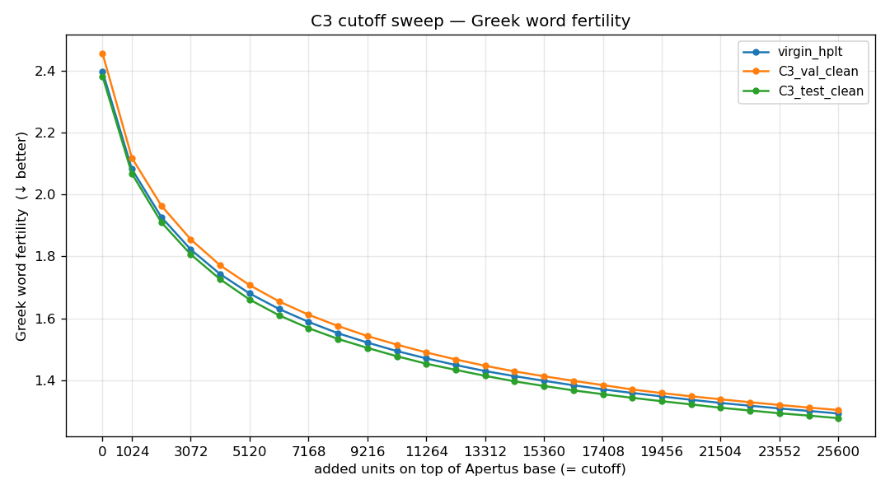
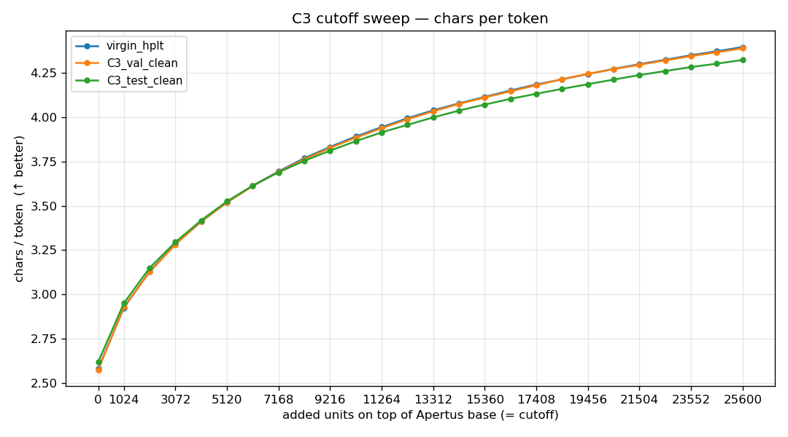
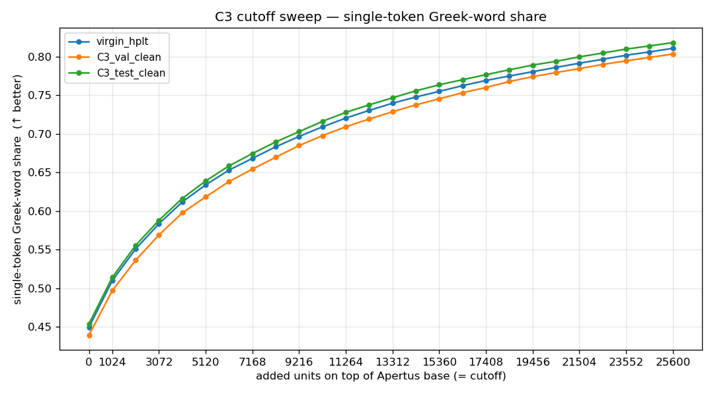
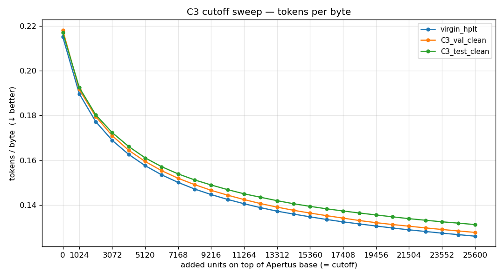
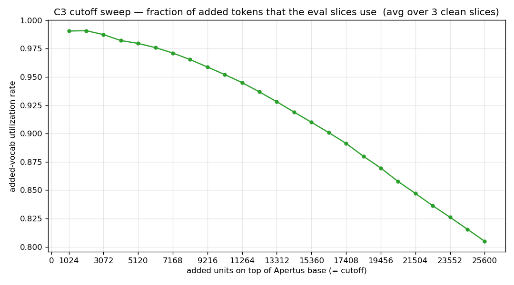
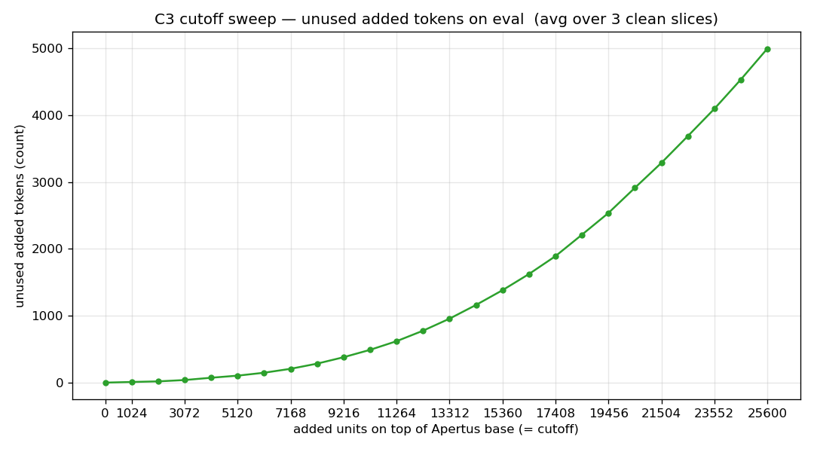

# C3 cutoff report

Date: 2026-05-11.

Tokenizer arm: **C3** (`C3_wave2_broad_glossapi_plus_hplt_50_50`, total
vocab 156,672). See [C3_CONVERGENCE.md](C3_CONVERGENCE.md).

This report sweeps the C3 cutoff at every multiple of 1024 from 1024
to 25600 (25 points, all 128-aligned). At each cutoff we built an
Apertus-compatible merged variant (just `model.vocab` + `model.merges`
truncated to `131072 + N`) and evaluated:

- intrinsic + fertility metrics on three **clean held-out** slices
- categorical composition of the kept added units, from the corrected
  25,600-token C3 glossary

## Held-out slices

All three are verified non-overlapping with C3 training (see
[C3_CONVERGENCE.md](C3_CONVERGENCE.md) § Held-out integrity).

| slice | docs | how it's clean |
| --- | ---: | --- |
| `virgin_hplt` | 10,000 | sampled from HPLT clean60 docs whose `source_doc_id` is **not in** the C3 training mix; guaranteed unseen by C3 BPE |
| `C3_val_clean` | 7,624 | C3 val with the 30 train-overlap text-md5 rows removed |
| `C3_test_clean` | 7,246 | C3 test with the 36 train-overlap text-md5 rows removed |

## Fertility & intrinsic metrics — per cutoff, per slice

The full numerical tables follow; PNG plots are linked first for the
shape.

### Plots

### Greek word fertility (lower is better)

| cutoff | virgin_hplt | C3_val_clean | C3_test_clean |
| ---: | ---: | ---: | ---: |
| 0 | 2.3986 | 2.4570 | 2.3826 |
| 1024 | 2.0820 | 2.1184 | 2.0674 |
| 2048 | 1.9270 | 1.9642 | 1.9102 |
| 3072 | 1.8222 | 1.8550 | 1.8064 |
| 4096 | 1.7427 | 1.7711 | 1.7260 |
| 5120 | 1.6801 | 1.7072 | 1.6605 |
| 6144 | 1.6301 | 1.6545 | 1.6096 |
| 7168 | 1.5884 | 1.6116 | 1.5682 |
| 8192 | 1.5518 | 1.5752 | 1.5334 |
| 9216 | 1.5215 | 1.5427 | 1.5043 |
| 10240 | 1.4942 | 1.5148 | 1.4774 |
| 11264 | 1.4705 | 1.4898 | 1.4532 |
| 12288 | 1.4491 | 1.4670 | 1.4333 |
| 13312 | 1.4295 | 1.4466 | 1.4140 |
| 14336 | 1.4130 | 1.4284 | 1.3962 |
| 15360 | 1.3981 | 1.4126 | 1.3812 |
| 16384 | 1.3836 | 1.3980 | 1.3670 |
| 17408 | 1.3704 | 1.3841 | 1.3547 |
| 18432 | 1.3587 | 1.3700 | 1.3430 |
| 19456 | 1.3475 | 1.3583 | 1.3320 |
| 20480 | 1.3366 | 1.3478 | 1.3217 |
| 21504 | 1.3265 | 1.3382 | 1.3109 |
| 22528 | 1.3174 | 1.3286 | 1.3019 |
| 23552 | 1.3086 | 1.3199 | 1.2930 |
| 24576 | 1.3005 | 1.3114 | 1.2854 |
| 25600 | 1.2922 | 1.3034 | 1.2772 |

### Chars per token (higher is better)

| cutoff | virgin_hplt | C3_val_clean | C3_test_clean |
| ---: | ---: | ---: | ---: |
| 0 | 2.5793 | 2.5731 | 2.6171 |
| 1024 | 2.9243 | 2.9292 | 2.9506 |
| 2048 | 3.1302 | 3.1266 | 3.1503 |
| 3072 | 3.2849 | 3.2826 | 3.2955 |
| 4096 | 3.4117 | 3.4126 | 3.4184 |
| 5120 | 3.5202 | 3.5194 | 3.5258 |
| 6144 | 3.6142 | 3.6128 | 3.6144 |
| 7168 | 3.6956 | 3.6930 | 3.6898 |
| 8192 | 3.7695 | 3.7632 | 3.7552 |
| 9216 | 3.8337 | 3.8280 | 3.8121 |
| 10240 | 3.8921 | 3.8855 | 3.8658 |
| 11264 | 3.9452 | 3.9391 | 3.9157 |
| 12288 | 3.9952 | 3.9893 | 3.9578 |
| 13312 | 4.0402 | 4.0345 | 4.0000 |
| 14336 | 4.0792 | 4.0761 | 4.0389 |
| 15360 | 4.1160 | 4.1129 | 4.0727 |
| 16384 | 4.1525 | 4.1478 | 4.1050 |
| 17408 | 4.1861 | 4.1817 | 4.1336 |
| 18432 | 4.2151 | 4.2163 | 4.1614 |
| 19456 | 4.2452 | 4.2460 | 4.1876 |
| 20480 | 4.2741 | 4.2729 | 4.2138 |
| 21504 | 4.3009 | 4.2972 | 4.2396 |
| 22528 | 4.3259 | 4.3225 | 4.2620 |
| 23552 | 4.3513 | 4.3459 | 4.2844 |
| 24576 | 4.3739 | 4.3682 | 4.3036 |
| 25600 | 4.3976 | 4.3901 | 4.3246 |

### Single-token Greek-word share (higher is better)

| cutoff | virgin_hplt | C3_val_clean | C3_test_clean |
| ---: | ---: | ---: | ---: |
| 0 | 0.4492 | 0.4390 | 0.4536 |
| 1024 | 0.5097 | 0.4968 | 0.5139 |
| 2048 | 0.5507 | 0.5362 | 0.5554 |
| 3072 | 0.5835 | 0.5690 | 0.5881 |
| 4096 | 0.6118 | 0.5977 | 0.6163 |
| 5120 | 0.6340 | 0.6183 | 0.6390 |
| 6144 | 0.6531 | 0.6382 | 0.6585 |
| 7168 | 0.6682 | 0.6543 | 0.6745 |
| 8192 | 0.6833 | 0.6697 | 0.6896 |
| 9216 | 0.6967 | 0.6849 | 0.7029 |
| 10240 | 0.7091 | 0.6977 | 0.7163 |
| 11264 | 0.7205 | 0.7092 | 0.7279 |
| 12288 | 0.7304 | 0.7193 | 0.7376 |
| 13312 | 0.7398 | 0.7287 | 0.7468 |
| 14336 | 0.7478 | 0.7376 | 0.7558 |
| 15360 | 0.7551 | 0.7455 | 0.7637 |
| 16384 | 0.7625 | 0.7533 | 0.7702 |
| 17408 | 0.7693 | 0.7602 | 0.7768 |
| 18432 | 0.7750 | 0.7679 | 0.7831 |
| 19456 | 0.7806 | 0.7741 | 0.7892 |
| 20480 | 0.7862 | 0.7795 | 0.7941 |
| 21504 | 0.7917 | 0.7847 | 0.7999 |
| 22528 | 0.7967 | 0.7900 | 0.8049 |
| 23552 | 0.8020 | 0.7947 | 0.8099 |
| 24576 | 0.8062 | 0.7990 | 0.8140 |
| 25600 | 0.8109 | 0.8036 | 0.8183 |

### Tokens per byte (lower is better)

| cutoff | virgin_hplt | C3_val_clean | C3_test_clean |
| ---: | ---: | ---: | ---: |
| 0 | 0.21513 | 0.21815 | 0.21705 |
| 1024 | 0.18974 | 0.19164 | 0.19252 |
| 2048 | 0.17727 | 0.17953 | 0.18031 |
| 3072 | 0.16892 | 0.17100 | 0.17237 |
| 4096 | 0.16264 | 0.16449 | 0.16617 |
| 5120 | 0.15762 | 0.15949 | 0.16111 |
| 6144 | 0.15353 | 0.15537 | 0.15716 |
| 7168 | 0.15014 | 0.15200 | 0.15395 |
| 8192 | 0.14720 | 0.14916 | 0.15127 |
| 9216 | 0.14474 | 0.14664 | 0.14901 |
| 10240 | 0.14256 | 0.14447 | 0.14694 |
| 11264 | 0.14064 | 0.14250 | 0.14507 |
| 12288 | 0.13888 | 0.14071 | 0.14352 |
| 13312 | 0.13734 | 0.13913 | 0.14201 |
| 14336 | 0.13602 | 0.13771 | 0.14064 |
| 15360 | 0.13481 | 0.13648 | 0.13948 |
| 16384 | 0.13362 | 0.13533 | 0.13838 |
| 17408 | 0.13255 | 0.13423 | 0.13742 |
| 18432 | 0.13164 | 0.13313 | 0.13650 |
| 19456 | 0.13071 | 0.13220 | 0.13565 |
| 20480 | 0.12982 | 0.13137 | 0.13481 |
| 21504 | 0.12901 | 0.13063 | 0.13399 |
| 22528 | 0.12827 | 0.12986 | 0.13328 |
| 23552 | 0.12752 | 0.12916 | 0.13258 |
| 24576 | 0.12686 | 0.12850 | 0.13199 |
| 25600 | 0.12617 | 0.12786 | 0.13135 |

## Composition of added units at each cutoff

Derived from the **corrected 25,600-token C3 glossary** (single Gemini
pass with morphological decomposition; see
`~/runs/c2_c3_analysis_20260506/c3_added_tokens_20260507/data/glossary/`).
Each cutoff column counts how many of the first N added units land in
each category / structure / lexical / confidence bucket. By
construction the rows in column N are a strict prefix of the rows in
column N+1024.

### Category × cutoff

| category | 1k | 2k | 3k | 4k | 5k | 6k | 7k | 8k | 9k | 10k | 11k | 12k | 13k | 14k | 15k | 16k | 17k | 18k | 19k | 20k | 21k | 22k | 23k | 24k | 25k |
| --- | ---: | ---: | ---: | ---: | ---: | ---: | ---: | ---: | ---: | ---: | ---: | ---: | ---: | ---: | ---: | ---: | ---: | ---: | ---: | ---: | ---: | ---: | ---: | ---: | ---: |
| `code_identifier` | 0 | 0 | 0 | 0 | 0 | 0 | 0 | 0 | 1 | 1 | 2 | 2 | 2 | 2 | 2 | 2 | 2 | 2 | 2 | 2 | 2 | 2 | 2 | 2 | 2 |
| `control_or_invisible` | 0 | 0 | 0 | 0 | 0 | 0 | 1 | 1 | 1 | 1 | 1 | 1 | 1 | 1 | 1 | 1 | 1 | 1 | 2 | 2 | 2 | 2 | 2 | 2 | 2 |
| `dingbat_or_symbol` | 0 | 0 | 0 | 0 | 0 | 0 | 0 | 0 | 0 | 0 | 0 | 0 | 0 | 0 | 0 | 0 | 0 | 0 | 2 | 2 | 2 | 2 | 2 | 2 | 2 |
| `encoding_artifact` | 4 | 4 | 6 | 6 | 6 | 7 | 8 | 10 | 10 | 12 | 14 | 14 | 14 | 14 | 16 | 16 | 17 | 17 | 18 | 20 | 20 | 21 | 22 | 23 | 23 |
| `escaped_character_run` | 1 | 2 | 2 | 3 | 3 | 3 | 3 | 4 | 4 | 5 | 5 | 5 | 5 | 5 | 5 | 5 | 5 | 6 | 6 | 6 | 6 | 7 | 9 | 9 | 9 |
| `greek_acronym` | 4 | 9 | 16 | 21 | 22 | 25 | 27 | 30 | 37 | 39 | 48 | 54 | 62 | 65 | 73 | 77 | 83 | 96 | 101 | 110 | 120 | 129 | 136 | 148 | 161 |
| `greek_fragment` | 457 | 906 | 1325 | 1727 | 2126 | 2515 | 2901 | 3284 | 3624 | 3987 | 4331 | 4677 | 5001 | 5321 | 5670 | 5989 | 6315 | 6628 | 6951 | 7278 | 7578 | 7860 | 8182 | 8477 | 8774 |
| `greek_morpheme` | 342 | 609 | 859 | 1084 | 1330 | 1540 | 1758 | 1944 | 2136 | 2311 | 2479 | 2645 | 2808 | 2965 | 3096 | 3267 | 3417 | 3558 | 3694 | 3847 | 3972 | 4092 | 4216 | 4346 | 4480 |
| `greek_word` | 204 | 496 | 830 | 1201 | 1565 | 1969 | 2368 | 2796 | 3256 | 3711 | 4182 | 4653 | 5164 | 5676 | 6170 | 6671 | 7171 | 7696 | 8214 | 8706 | 9261 | 9820 | 10354 | 10889 | 11425 |
| `latin_abbreviation` | 0 | 0 | 0 | 0 | 0 | 0 | 0 | 0 | 0 | 0 | 0 | 0 | 0 | 0 | 0 | 0 | 0 | 0 | 1 | 2 | 2 | 2 | 2 | 2 | 2 |
| `latin_acronym` | 0 | 0 | 0 | 0 | 0 | 0 | 0 | 0 | 3 | 3 | 3 | 3 | 3 | 3 | 3 | 3 | 3 | 3 | 3 | 3 | 3 | 3 | 3 | 5 | 5 |
| `latin_fragment` | 0 | 0 | 0 | 1 | 1 | 1 | 1 | 1 | 1 | 2 | 2 | 2 | 2 | 2 | 3 | 3 | 3 | 4 | 5 | 6 | 7 | 8 | 9 | 10 | 10 |
| `latin_word` | 0 | 0 | 0 | 0 | 0 | 0 | 0 | 0 | 0 | 0 | 0 | 0 | 0 | 0 | 3 | 3 | 3 | 3 | 3 | 3 | 3 | 4 | 4 | 5 | 6 |
| `math_symbol` | 1 | 1 | 2 | 3 | 3 | 4 | 4 | 4 | 4 | 4 | 6 | 6 | 7 | 7 | 9 | 9 | 9 | 9 | 10 | 11 | 12 | 12 | 13 | 14 | 14 |
| `mixed_script_token` | 1 | 6 | 8 | 11 | 13 | 14 | 18 | 20 | 25 | 28 | 31 | 33 | 35 | 37 | 41 | 45 | 50 | 57 | 59 | 61 | 63 | 69 | 72 | 77 | 77 |
| `mojibake` | 0 | 0 | 0 | 0 | 0 | 0 | 0 | 0 | 0 | 0 | 0 | 2 | 2 | 2 | 3 | 3 | 3 | 3 | 3 | 3 | 3 | 5 | 5 | 5 | 6 |
| `postscript_glyph` | 0 | 0 | 0 | 0 | 0 | 0 | 0 | 0 | 0 | 0 | 1 | 2 | 3 | 3 | 6 | 8 | 9 | 10 | 10 | 12 | 12 | 12 | 12 | 14 | 14 |
| `proper_noun` | 1 | 6 | 11 | 25 | 35 | 46 | 57 | 74 | 86 | 106 | 127 | 155 | 168 | 193 | 215 | 233 | 265 | 283 | 313 | 345 | 374 | 409 | 434 | 468 | 505 |
| `punctuation_run` | 3 | 3 | 7 | 7 | 8 | 11 | 11 | 13 | 15 | 17 | 19 | 20 | 21 | 24 | 27 | 31 | 34 | 36 | 38 | 40 | 40 | 45 | 48 | 53 | 55 |
| `table_separator` | 4 | 4 | 4 | 5 | 6 | 7 | 8 | 8 | 9 | 9 | 9 | 10 | 10 | 12 | 13 | 14 | 14 | 15 | 16 | 16 | 16 | 18 | 19 | 19 | 21 |
| `unit_or_measure` | 0 | 0 | 0 | 0 | 0 | 0 | 0 | 0 | 1 | 1 | 1 | 1 | 1 | 1 | 1 | 1 | 1 | 1 | 1 | 1 | 1 | 1 | 1 | 1 | 1 |
| `url_or_path` | 1 | 1 | 1 | 1 | 1 | 1 | 2 | 2 | 2 | 2 | 2 | 2 | 2 | 2 | 2 | 2 | 2 | 3 | 3 | 3 | 3 | 3 | 3 | 3 | 4 |
| `whitespace_only` | 1 | 1 | 1 | 1 | 1 | 1 | 1 | 1 | 1 | 1 | 1 | 1 | 1 | 1 | 1 | 1 | 1 | 1 | 1 | 1 | 2 | 2 | 2 | 2 | 2 |

### Greek morphological structure × cutoff

Note: structure is defined only on Greek tokens (greek_word /
greek_fragment / greek_morpheme / proper_noun / greek_acronym). Non-Greek
categories contribute zero to this view.

| structure | 1k | 2k | 3k | 4k | 5k | 6k | 7k | 8k | 9k | 10k | 11k | 12k | 13k | 14k | 15k | 16k | 17k | 18k | 19k | 20k | 21k | 22k | 23k | 24k | 25k |
| --- | ---: | ---: | ---: | ---: | ---: | ---: | ---: | ---: | ---: | ---: | ---: | ---: | ---: | ---: | ---: | ---: | ---: | ---: | ---: | ---: | ---: | ---: | ---: | ---: | ---: |
| `ending` | 131 | 203 | 276 | 328 | 375 | 422 | 479 | 528 | 564 | 606 | 638 | 672 | 697 | 731 | 749 | 775 | 790 | 815 | 837 | 864 | 889 | 908 | 934 | 954 | 976 |
| `fragment` | 358 | 718 | 1039 | 1344 | 1654 | 1946 | 2230 | 2522 | 2782 | 3051 | 3332 | 3589 | 3836 | 4075 | 4330 | 4561 | 4806 | 5046 | 5296 | 5533 | 5757 | 5965 | 6206 | 6434 | 6664 |
| `prefix` | 21 | 39 | 50 | 64 | 85 | 95 | 102 | 110 | 119 | 123 | 132 | 138 | 147 | 153 | 156 | 164 | 170 | 172 | 178 | 182 | 185 | 188 | 190 | 192 | 194 |
| `prefix+stem` | 7 | 22 | 31 | 39 | 46 | 60 | 78 | 87 | 97 | 112 | 121 | 133 | 138 | 155 | 167 | 177 | 184 | 199 | 210 | 221 | 227 | 234 | 242 | 254 | 260 |
| `prefix+stem+ending` | 13 | 44 | 100 | 151 | 213 | 282 | 358 | 437 | 524 | 619 | 718 | 821 | 920 | 1035 | 1133 | 1246 | 1358 | 1490 | 1614 | 1730 | 1859 | 1996 | 2112 | 2240 | 2354 |
| `prefix+stem+stem` | 0 | 0 | 0 | 0 | 1 | 1 | 1 | 1 | 1 | 1 | 1 | 1 | 1 | 1 | 1 | 1 | 1 | 1 | 1 | 1 | 2 | 2 | 2 | 2 | 2 |
| `prefix+stem+stem+ending` | 0 | 0 | 0 | 0 | 0 | 0 | 0 | 0 | 1 | 2 | 2 | 2 | 2 | 3 | 3 | 3 | 4 | 5 | 5 | 6 | 8 | 9 | 10 | 11 | 12 |
| `prefix+stem_partial` | 41 | 77 | 108 | 137 | 177 | 196 | 230 | 265 | 304 | 327 | 354 | 389 | 412 | 438 | 461 | 501 | 530 | 551 | 571 | 601 | 629 | 665 | 687 | 714 | 730 |
| `stem` | 174 | 297 | 415 | 527 | 659 | 764 | 870 | 952 | 1053 | 1131 | 1226 | 1302 | 1389 | 1461 | 1538 | 1632 | 1709 | 1793 | 1861 | 1952 | 2003 | 2074 | 2154 | 2221 | 2291 |
| `stem+ending` | 170 | 435 | 716 | 1045 | 1339 | 1684 | 1999 | 2355 | 2726 | 3089 | 3450 | 3819 | 4215 | 4612 | 5002 | 5381 | 5774 | 6150 | 6541 | 6910 | 7333 | 7734 | 8121 | 8512 | 8932 |
| `stem+ending_partial` | 4 | 17 | 32 | 46 | 66 | 88 | 104 | 114 | 128 | 143 | 159 | 172 | 189 | 204 | 218 | 231 | 247 | 259 | 269 | 283 | 292 | 300 | 311 | 328 | 343 |
| `stem+stem` | 1 | 3 | 5 | 9 | 13 | 14 | 16 | 18 | 20 | 24 | 25 | 30 | 37 | 37 | 42 | 44 | 51 | 53 | 60 | 66 | 73 | 81 | 86 | 89 | 95 |
| `stem+stem+ending` | 0 | 0 | 3 | 8 | 17 | 28 | 39 | 45 | 57 | 66 | 77 | 87 | 106 | 116 | 125 | 137 | 146 | 158 | 171 | 180 | 196 | 214 | 239 | 257 | 271 |
| `stem_partial` | 83 | 156 | 239 | 314 | 376 | 444 | 521 | 590 | 640 | 715 | 757 | 820 | 884 | 941 | 1011 | 1074 | 1133 | 1190 | 1245 | 1302 | 1358 | 1402 | 1458 | 1504 | 1555 |

### Greek lexical role × cutoff

Lexical is defined only for Greek tokens that fit one of the four
named roles; `none` is the residual greek-but-not-tagged set.

| lexical | 1k | 2k | 3k | 4k | 5k | 6k | 7k | 8k | 9k | 10k | 11k | 12k | 13k | 14k | 15k | 16k | 17k | 18k | 19k | 20k | 21k | 22k | 23k | 24k | 25k |
| --- | ---: | ---: | ---: | ---: | ---: | ---: | ---: | ---: | ---: | ---: | ---: | ---: | ---: | ---: | ---: | ---: | ---: | ---: | ---: | ---: | ---: | ---: | ---: | ---: | ---: |
| `abbreviation` | 1 | 8 | 12 | 17 | 21 | 25 | 28 | 30 | 35 | 38 | 40 | 41 | 47 | 50 | 52 | 55 | 56 | 60 | 63 | 65 | 65 | 68 | 69 | 71 | 75 |
| `function_word` | 93 | 166 | 226 | 280 | 334 | 382 | 426 | 477 | 533 | 567 | 603 | 629 | 666 | 699 | 737 | 767 | 789 | 818 | 845 | 885 | 910 | 940 | 976 | 1011 | 1035 |
| `loanword` | 5 | 11 | 19 | 29 | 48 | 61 | 78 | 106 | 125 | 151 | 173 | 201 | 233 | 257 | 291 | 320 | 359 | 397 | 429 | 463 | 487 | 520 | 552 | 576 | 602 |
| `none` | 900 | 1807 | 2718 | 3615 | 4531 | 5446 | 6360 | 7255 | 8145 | 9047 | 9949 | 10855 | 11752 | 12659 | 13525 | 14427 | 15315 | 16201 | 17085 | 17946 | 18857 | 19732 | 20616 | 21489 | 22372 |
| `proper_noun` | 4 | 19 | 39 | 71 | 87 | 110 | 135 | 156 | 178 | 206 | 227 | 249 | 275 | 297 | 331 | 358 | 384 | 406 | 437 | 472 | 492 | 512 | 539 | 565 | 595 |

### Glossary confidence × cutoff

Confidence is the Gemini-pass per-token confidence from the corrected
glossary.

| confidence | 1k | 2k | 3k | 4k | 5k | 6k | 7k | 8k | 9k | 10k | 11k | 12k | 13k | 14k | 15k | 16k | 17k | 18k | 19k | 20k | 21k | 22k | 23k | 24k | 25k |
| --- | ---: | ---: | ---: | ---: | ---: | ---: | ---: | ---: | ---: | ---: | ---: | ---: | ---: | ---: | ---: | ---: | ---: | ---: | ---: | ---: | ---: | ---: | ---: | ---: | ---: |
| >=0.9 | 393 | 802 | 1258 | 1741 | 2211 | 2720 | 3208 | 3734 | 4273 | 4819 | 5361 | 5913 | 6486 | 7085 | 7659 | 8227 | 8799 | 9382 | 9974 | 10549 | 11167 | 11830 | 12421 | 13018 | 13637 |
| 0.7-0.9 | 531 | 1054 | 1518 | 1950 | 2396 | 2787 | 3208 | 3598 | 3992 | 4384 | 4769 | 5136 | 5498 | 5822 | 6183 | 6557 | 6909 | 7246 | 7557 | 7898 | 8212 | 8484 | 8814 | 9146 | 9457 |
| 0.5-0.7 | 100 | 192 | 296 | 405 | 513 | 637 | 751 | 858 | 949 | 1035 | 1130 | 1234 | 1323 | 1424 | 1513 | 1594 | 1694 | 1797 | 1916 | 2023 | 2115 | 2204 | 2306 | 2401 | 2493 |
| <0.5 | 0 | 0 | 0 | 0 | 0 | 0 | 1 | 2 | 2 | 2 | 4 | 5 | 5 | 5 | 5 | 6 | 6 | 7 | 9 | 10 | 10 | 10 | 11 | 11 | 13 |

## Marginal fertility per cutoff step (avg over 3 slices)

| cutoff | fert | Δ fert | chars/tok | Δ chars/tok | added-vocab util | unused added |
| ---: | ---: | ---: | ---: | ---: | ---: | ---: |
| 0 | 2.4127 | — | 2.5898 | — | — | — |
| 1024 | 2.0893 | −0.3235 | 2.9347 | +0.3449 | 0.9906 | 10 |
| 2048 | 1.9338 | −0.1555 | 3.1357 | +0.2010 | 0.9909 | 19 |
| 3072 | 1.8279 | −0.1059 | 3.2877 | +0.1520 | 0.9874 | 39 |
| 4096 | 1.7466 | −0.0813 | 3.4142 | +0.1266 | 0.9822 | 73 |
| 5120 | 1.6826 | −0.0640 | 3.5218 | +0.1076 | 0.9796 | 104 |
| 6144 | 1.6314 | −0.0512 | 3.6138 | +0.0920 | 0.9759 | 148 |
| 7168 | 1.5894 | −0.0420 | 3.6928 | +0.0790 | 0.9712 | 207 |
| 8192 | 1.5534 | −0.0360 | 3.7626 | +0.0698 | 0.9653 | 284 |
| 9216 | 1.5228 | −0.0306 | 3.8246 | +0.0620 | 0.9588 | 380 |
| 10240 | 1.4955 | −0.0274 | 3.8812 | +0.0566 | 0.9521 | 490 |
| 11264 | 1.4711 | −0.0243 | 3.9333 | +0.0521 | 0.9450 | 620 |
| 12288 | 1.4498 | −0.0213 | 3.9808 | +0.0474 | 0.9368 | 777 |
| 13312 | 1.4300 | −0.0197 | 4.0249 | +0.0442 | 0.9281 | 957 |
| 14336 | 1.4125 | −0.0175 | 4.0647 | +0.0398 | 0.9190 | 1162 |
| 15360 | 1.3973 | −0.0152 | 4.1005 | +0.0358 | 0.9100 | 1382 |
| 16384 | 1.3828 | −0.0145 | 4.1351 | +0.0346 | 0.9009 | 1624 |
| 17408 | 1.3697 | −0.0131 | 4.1671 | +0.0320 | 0.8913 | 1892 |
| 18432 | 1.3572 | −0.0125 | 4.1976 | +0.0305 | 0.8800 | 2212 |
| 19456 | 1.3459 | −0.0113 | 4.2263 | +0.0286 | 0.8696 | 2537 |
| 20480 | 1.3354 | −0.0105 | 4.2536 | +0.0274 | 0.8577 | 2914 |
| 21504 | 1.3252 | −0.0102 | 4.2792 | +0.0256 | 0.8472 | 3287 |
| 22528 | 1.3160 | −0.0092 | 4.3035 | +0.0242 | 0.8363 | 3688 |
| 23552 | 1.3072 | −0.0088 | 4.3272 | +0.0237 | 0.8261 | 4095 |
| 24576 | 1.2991 | −0.0080 | 4.3486 | +0.0214 | 0.8155 | 4534 |
| 25600 | 1.2909 | −0.0082 | 4.3708 | +0.0222 | 0.8049 | 4995 |

Marginal fertility gain halves roughly every 2–3k added units. Per-step
gains drop below 1% of the base fertility (≈ 0.024 absolute) after
~10k. Unused-added tokens grow super-linearly past ~12k, crossing 1000
around 14k and 5000 at 25600.

## Reading guide

- **Diminishing fertility returns**: sharpest drop is base → 1024
  (Δ −0.32). The curve has clearly bent by ~6–8k and is largely flat
  past ~15k.
- **Added-vocab utilization** is monotonically falling: 99% at 1024,
  ~93% at 13k, drops below 90% at ~16k, ~80% at 25.6k. Above ~16–18k
  you start paying embedding rows for tokens not exercised on these
  clean slices.
- **Greek-word vs greek-fragment growth**: at small cutoffs the
  composition is fragment-heavy; whole-word inflected Greek forms
  appear later in the merge order. The category × cutoff table shows
  where each category accelerates.
- **Shipping size must remain 128-divisible**. All cutoffs in this
  sweep already satisfy that.
